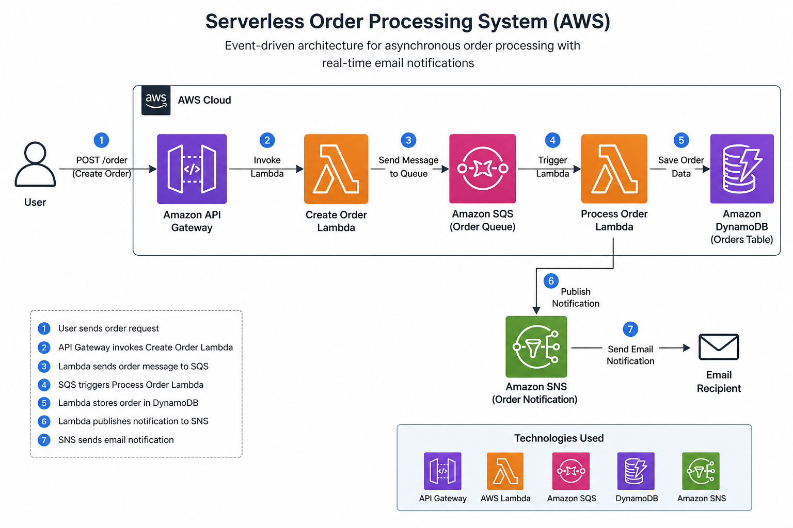

# 🚀 Serverless Order Processing System

## 📌 Overview
This project demonstrates a serverless architecture using AWS services to create and process orders.

## 🛠️ Tech Stack
- AWS Lambda
- API Gateway
- DynamoDB
- CloudFormation

## 🏗️ Architecture

## ⚙️ Features
- Create Order API
- Process Order system
- Fully serverless

## 🚀 Deployment
Using AWS CloudFormation

## 📸 Screenshots
(Add later)

## 🧪 Test Cases
(Add later)
